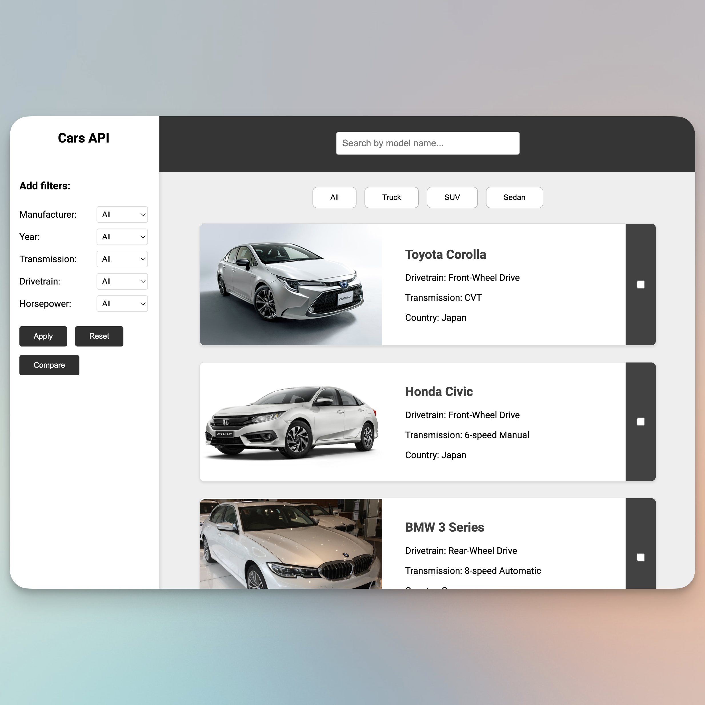

## Cars is a simple website that showcases information about different car models, their specifications, manufacturers, and more.



# Installation Instructions

This document provides the instructions to install and run the components of the program. Please follow the steps below carefully.

## Setup

To use the program, you need to open two separate terminal windows or tabs.

### Terminal 1:

Navigate to the `/api` directory of the project:

```sh
cd api
```

Once inside the `/api` directory, run the following commands:

```sh
make build
make run
```

If the above commands do not work, use npm as follows:

```sh
npm install
npm start
```

### Terminal 2:

Ensure you are in the root directory of the project. Then run the Go program by executing:

```sh
go run cmd/main.go
```

## Troubleshooting

If you encounter any issues with `make build` or `make run`, ensure you have `make` installed and the Makefile is correctly set up.

If `npm install` or `npm start` fails, check if npm is installed correctly and if you are in the correct directory (`/api`).
